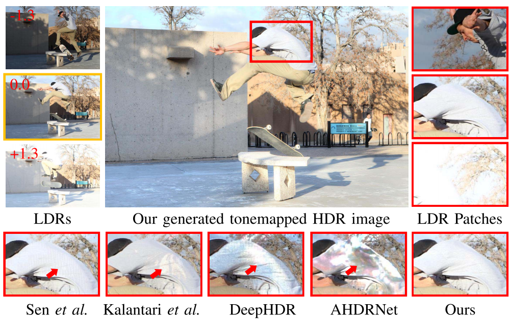

# HDR-GAN: HDR Image Reconstruction From Multi-Exposed LDR Images With Large Motions
 



This is the implementation for [HDR-GAN: HDR Image Reconstruction From Multi-Exposed LDR Images With Large Motions](https://ieeexplore.ieee.org/document/9387148),
Yuzhen Niu, Jianbin Wu, Wenxi Liu, Wenzhong Guo, Rynson W. H. Lau, in IEEE Transactions on Image Processing, 2021.  
In this work, we proposed a novel GAN-based model, HDR-GAN, 
which produces high-quality HDR images from multi-exposed LDR images without the need to explicitly align the LDR images.


## Prerequisites
### Install required packages
```
pip install -r requirements.txt
```

## Quickly start
### Train
* Download training set of [Kalantari's dataset](https://cseweb.ucsd.edu/~viscomp/projects/SIG17HDR/), decompress and put it in `./dataset` folder
```
dataset/
└── kalantari_dataset
    └── train
        ├── 16-09-28-01
        ├── 16-09-28-05
        ├── 16-09-28-06
        ├── 16-10-10-a-01
        ├── ....
        └── yyy
```
* Start training
```shell script
python train.py \
    --epoch 256000 \
    --train_hw 512 512 \
    --batch_size 2 \
    --depth 3 \
    --unetpps \
    --gpu 0 \
    --loss_gan \
    --gan sphere \
    --lr 1e-4
```

You can change learning rate during training process by creating `c{PID}.conf` file with the content as follow:  
```
LR: 1e-5
```

To monitor training, you can use Tensorboard in `.\logs` dir 

### Test

```shell script
python test.py \
     --unetpps \
     --gpu 0 \
     --ckpt pretrained/model \
     --cus_test_ds dataset/test
```
The output results are name as `xxx_0.hdr` and `xxx_1.hdr`, corresponding to the two results of deep HDR supervision in paper, respectively.
You may use [Photomatix](https://www.hdrsoft.com/) for tonemapping `.hdr` files to obtain better visual effects. 

### Citation
``` BibTeX
@article{niu2021hdr,
  title={HDR-GAN: HDR image reconstruction from multi-exposed ldr images with large motions},
  author={Niu, Yuzhen and Wu, Jianbin and Liu, Wenxi and Guo, Wenzhong and Lau, Rynson WH},
  journal={IEEE Transactions on Image Processing},
  volume={30},
  pages={3885--3896},
  year={2021},
  publisher={IEEE}
}
```
